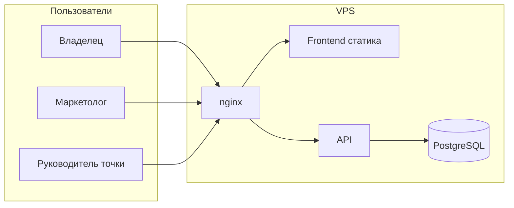

# Черновая архитектура — Grove Pulse (веб-дашборд)

**Версия:** 0.4  
**Дата:** 2026-03-31  
**Статус:** согласовано с владельцем (PRD v1); Ozon как виртуальная точка — [`development-plan-v1.md`](./development-plan-v1.md)  
**Основание:** [`prd.md`](../product%20docs/prd.md), [`mvp-scope.md`](../product%20docs/mvp-scope.md), [`metrics-registry.md`](../product%20docs/metrics-registry.md), [`data-map.md`](../product%20docs/data-map.md), [`company-context.md`](../product%20docs/company-context.md)  

**Стек (целевой):** Docker Compose, PostgreSQL 15, Python 3.12 API, nginx, Node.js / pnpm (frontend)

---

## 1. Контекст и границы системы

**Назначение:** закрытое веб-приложение для еженедельного ручного ввода метрик и просмотра дашбордов (владелец, маркетолог, руководитель точки). Внешние кабинеты (Яндекс.Метрика, Директ, Ozon, карты и т.д.) **не интегрируются** в v1 — пользователь переносит цифры вручную.

**Акторы:** браузер пользователя; администратор развёртывания (сид пользователей и справочников). **Исторические данные до запуска не импортируются** — учёт с первой сохранённой отчётной недели.

**Граница:** всё за пределами VPS и браузера — вне контроля приложения (источники данных, регламент ввода по понедельникам).

---

## 2. Логическая архитектура

- **Клиент (SPA):** авторизация, формы ввода по ролям, дашборд владельца, drill-down отчёты, выбор отчётной недели и периода агрегации.
- **Reverse proxy (nginx):** TLS-терминация на prod, раздача статики фронта, проксирование `/api` на бэкенд.
- **API (Python):** аутентификация и сессии/JWT, авторизация по ролям, CRUD ввода по неделям, расчёт производных и агрегатов для дашбордов (чтение из БД).
- **БД (PostgreSQL):** нормализованное хранение справочников, фактов ввода за неделю, снимков репутации; без решений, навсегда запрещающих экспорт в v2 ([`mvp-scope.md`](../product%20docs/mvp-scope.md) §4).

Производные метрики (`OFF-AVG-CHK`, `DER-*`, приросты репутации и т.д.) **считаются на бэкенде** по правилам [`metrics-registry.md`](../product%20docs/metrics-registry.md), в БД хранятся в основном первичные вводы и снимки.

---

## 3. Компоненты

| Компонент | Назначение | Технология |
|-----------|------------|------------|
| **web** | UI: логин, ввод, дашборды, графики | SPA (конкретный фреймворк — в [`dev-handoff-spec.md`](./dev-handoff-spec.md)) |
| **api** | REST/JSON, бизнес-логика, расчёты | Python 3.12 (FastAPI или эквивалент — уточнение в ТЗ) |
| **db** | Персистентность | PostgreSQL 15 |
| **proxy** | HTTPS, статика, маршрутизация | nginx (Alpine) |
| **scheduler (опционально v1)** | Еженедельный дамп БД (**воскресенье**) | `cron` на хосте или контейнер с cron — см. §9 |

Интеграционных шин, очередей и отдельного read-replica в v1 **нет**.

---

## 4. Модель данных (черновик)

### 4.1 Справочник точек v1 (сид)

Коды стабильны для ключей в БД, URL и отчётов; отображаемое имя — для UI.

| Код (`outlet.code`) | Отображаемое имя |
|---------------------|------------------|
| `NOVOGRAD` | Точка на Новоградском |
| `SVERDLOV` | Точка на Свердловском |

Тот же перечень зафиксирован в [`glossary.md`](../product%20docs/glossary.md) (**Справочник точек v1**) как единый язык с PRD, [`mvp-scope.md`](../product%20docs/mvp-scope.md) и [`data-map.md`](../product%20docs/data-map.md).

Третья «логическая» сущность продаж — **Ozon**: в v1 **только** запись в справочнике **`outlets`** с **`is_virtual = true`**, код **`OZON`**, недельные метрики Ozon привязаны к этому `outlet_id` (решение [`development-plan-v1.md`](./development-plan-v1.md)); поведение продукта — [`metrics-registry.md`](../product%20docs/metrics-registry.md) §4.

### 4.2 Ключевые сущности

| Сущность | Назначение | Связи |
|----------|------------|--------|
| **User** | Учётная запись, хэш пароля, отображаемое имя | M:N с **Outlet** для роли «руководитель точки» (0, 1 или 2 физические точки) |
| **Role** | Одна роль на пользователя v1: `owner`, `marketer`, `site_manager` | Зашито в enum или справочнике |
| **Outlet** | Физическая точка (2 строки v1) + при необходимости виртуальный Ozon | Связь с офлайн-метриками и репутацией |
| **ReportingWeek** | Отчётная неделя: однозначный ключ (например, дата **понедельника** ISO-пн в `date` + при необходимости `iso_year`/`iso_week`) | Все недельные факты ссылаются на эту сущность |
| **WeeklyOfflineMetrics** | Первичный ввод `OFF-*` за неделю **в разрезе точки** | `reporting_week` + `outlet` |
| **WeeklyOzonMetrics** | Первичный ввод `OZ-*` за неделю | `reporting_week` + **`outlet_id`** виртуальной точки **`OZON`** |
| **WeeklyMarketingSite** | Реклама (`MKT-AD-*`), строки сайта `WEB-*` за неделю | `reporting_week`; глобально на компанию |
| **ReputationSnapshot** | Снимок `REP-*`: дата снимка, точка, площадка (2ГИС / Яндекс.Карты), рейтинг, число отзывов | `outlet`, справочник площадки; приросты — расчёт от предыдущего снимка той же пары |

**Уникальность ввода:** для каждой комбинации (неделя, сущность разреза) не более **одной** принятой записи ввода — либо upsert по сохранению формы, либо явная версия; деталь в [`dev-handoff-spec.md`](./dev-handoff-spec.md).

**Репутация:** хранить факт снимка с **датой** (день ввода/снимка); агрегация месяц/квартал — «последний снимок в периоде» по паре точка×площадка ([`metrics-registry.md`](../product%20docs/metrics-registry.md) §3).

### 4.3 Принципы

- Гранулярность ввода продаж и маркетинга (кроме репутации) — **отчётная неделя пн–вс**.
- Репутация — **снимок на дату**; несколько снимков в одной календарной неделе в v1 не требуются по продукту, но схема может хранить историю по датам для графиков.
- Производные не дублировать в БД на старте **не обязательно**; допустим расчёт при запросе дашборда при малом объёме данных. При необходимости позже — материализованные представления или кэш.
- Схема должна позволять **добавить точки и каналы** без ломки ключей ([`mvp-scope.md`](../product%20docs/mvp-scope.md) §4).
- Поля планов, экспорта, аудита действий — **не** в v1; таблицы под планы не создавать до v2.

### 4.4 Руководитель двух точек

- В модели: пользователь с ролью `site_manager` связан с **двумя** записями `Outlet` через таблицу связи.
- В UI/API: параметр **активной точки** (или контекст сессии) при чтении/записи формы `OFF-*`; сохранение всегда явно привязано к `(user, outlet, week)` с проверкой, что outlet разрешён этому пользователю.

**Общая учётка двух людей:** продуктово целевой сценарий v1 — **один пользователь — одна роль**, два магазина у одного руководителя — переключатель. Если организационно допускается вход двух сотрудников под одним логином, это **обходит идентификацию** в системе; архитектурно не усложняем модель — риск и регламент на стороне бизнеса.

---

## 5. API (обзор)

REST/JSON, единый префикс `/api` (через nginx).

| Область | Операции (черновик) |
|---------|---------------------|
| **Auth** | Логин, логаут; **сессии в PostgreSQL** + httpOnly cookie — [`dev-handoff-spec.md`](./dev-handoff-spec.md) §9 |
| **Me** | Текущий пользователь, роль, список доступных точек (для руководителя), активная точка |
| **Weeks** | Список доступных для выбора отчётных недель (до трёх предыдущих пн–вс) |
| **Ввод** | GET/PUT недельных пакетов по роли: офлайн по точке, Ozon, маркетинг+сайт, репутация (снимки) |
| **Дашборды** | GET агрегированных сводов для владельца/маркетолога: период `week` \| `month` \| `quarter`, блоки по [`prd.md`](../product%20docs/prd.md) §5.3; предыдущий период + % для ключевых KPI |
| **Отчёты (drill-down)** | GET рядов для графиков по теме блока, фильтры (точка, площадка карт и т.д.) |

Ошибки: 401/403 по ролям; 422 валидация (в т.ч. неполный набор обязательных полей); идемпотентность сохранения недели — по решению реализации.

---

## 6. Фронтенд (обзор)

**Страницы / потоки:**

- Логин.
- После входа: **владелец и маркетолог** — главный дашборд владельца; **руководитель** — экран выбора недели и ввода по точке (переключатель точки при двух привязках).
- Формы ввода по ролям (см. [`metrics-registry.md`](../product%20docs/metrics-registry.md) + [`prd.md`](../product%20docs/prd.md)): неделя из доступных; маркетолог — блоки маркетинга, сайта, репутации, Ozon; руководитель — только `OFF-*` для выбранной точки.
- Drill-down: отдельный маршрут на блок (сайт, точки, карты 2ГИС/Яндекс отдельно при необходимости, Ozon, возвраты) с графиками и выбором диапазона.

**Ключевые KPI на главной (рекомендация для макета и [`dev-handoff-spec.md`](./dev-handoff-spec.md))** — ориентир «что смотрит владелец первым»:

| Блок | Ключевые KPI (текущий период + предыдущий + %) |
|------|--------------------------------------------------|
| **Сайт** | `WEB-TRF-TOT`; доля/абсолют по трём каналам кратко или только итого + `WEB-BEH-BOUNCE`, `WEB-BEH-TIME` |
| **Точки** | `DER-REV-TOT` (с разбивкой по точкам в превью или сумма); по каждой точке в сводке: `OFF-REV`, `OFF-ORD`, `OFF-AVG-CHK` |
| **Карты (2ГИС / Яндекс)** | по каждой площадке: средняя `REP-RATING`, `REP-REV-CNT`, прирост отзывов за период (из снимков) |
| **Ozon** | `OZ-REV`, `OZ-ORD`, `OZ-AD-SPEND`, при необходимости `OZ-AVG-CHK` |
| **Возвраты (свод компании)** | суммы и количества: офлайн (все точки) + Ozon — `OFF-RET-*` агрегированно и `OZ-RET-*` |

Точный состав 2–4 цифр в карточке блока и вёрстка — в макете; ID метрик не менять.

---

## 7. Развёртывание

- **Dev:** Docker Compose локально; hot-reload API и фронта по стандарту команды.
- **Prod:** VPS; Compose (или оркестрация на усмотрение); образы из CI при наличии.
- **Репозиторий:** GitHub ([`company-context.md`](../product%20docs/company-context.md) §7).
- **Конфигурация:** переменные окружения (строка БД, секрет сессии/JWT, `CORS` при необходимости); пароли пользователей приложения — только хэши в БД.
- **Сид:** миграции + скрипт/фикстуры: роли, пользователи (владельцы, маркетолог, руководитель), две точки с кодами из §4.1; при необходимости запись `OZON` в справочнике.

---

## 8. Безопасность (MVP)

- **Транспорт:** HTTPS на prod (Let's Encrypt или иной сертификат).
- **Аутентификация:** логин/пароль; политика сложности пароля и сброс — в [`dev-handoff-spec.md`](./dev-handoff-spec.md).
- **Авторизация:** проверка роли и области (владелец не пишет чужие формы; руководитель — только свои outlet id).
- **Заголовки:** базовый набор (например, `X-Content-Type-Options`, `Frame-Options`) — по чеклисту в ТЗ.
- **Аудит действий пользователей** в v1 не обязателен ([`mvp-scope.md`](../product%20docs/mvp-scope.md) §4).

---

## 9. Резервное копирование

- **Решение v1:** полный **дамп PostgreSQL раз в неделю**, **по воскресеньям в 18:00 GMT (UTC)** (`pg_dump`); cron на VPS: интерпретация в **UTC** (например `0 18 * * 0` при `TZ=UTC`) — детали в [`dev-handoff-spec.md`](./dev-handoff-spec.md) §13.
- Хранение: локальный диск VPS и/или выгрузка на внешнее хранилище — по возможностям команды; срок хранения ретенции зафиксировать в runbook.
- Восстановление: процедура «развернуть БД из последнего дампа» описывается в README/runbook, не в коде продукта.

---

## 10. Расширения (вне v1, закладки)

- Выгрузки CSV/Excel; план-факт и плановые сущности; раздельный учёт рекламы 2ГИС vs Яндекс.Карты; комментарии к неделе; аудит; напоминания о полноте недели.

---

## История изменений

| Версия | Дата | Изменения |
|--------|------|-----------|
| 0.1 | — | Каркас документа |
| 0.2 | 2026-03-31 | Контекст, компоненты, модель данных, справочник точек (NOVOGRAD, SVERDLOV), API и фронт обзор, деплой, безопасность, ежедневный дамп БД, сценарий двух точек / общий логин, ключевые KPI для главной |
| 0.2.1 | 2026-03-31 | §4.1: перекрёстная ссылка на [`glossary.md`](../product%20docs/glossary.md) (дублирование норматива кодов точек) |
| 0.3 | 2026-03-31 | §3, §9: бэкап **еженедельно по воскресеньям** (синхронизация с [`dev-handoff-spec.md`](./dev-handoff-spec.md)); статус документа |
| 0.3.1 | 2026-03-31 | §5 Auth: сессии в БД; §9: время бэкапа **18:00 GMT** |
| 0.4 | 2026-03-31 | §4.1–4.2: Ozon только как виртуальный `outlet` OZON; связь `WeeklyOzonMetrics` с `outlet_id` |
